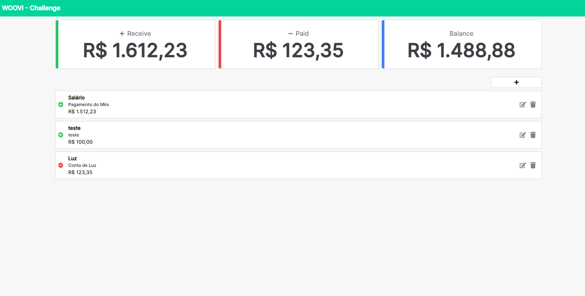
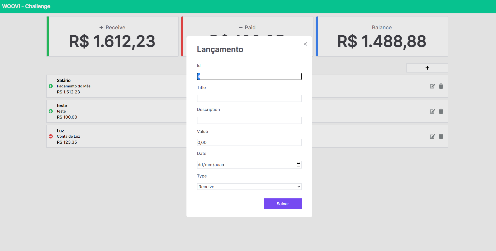
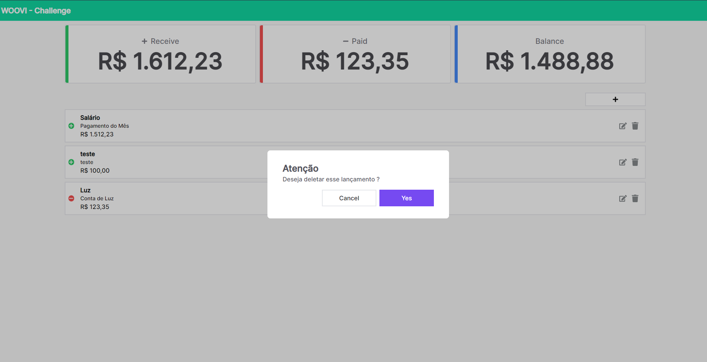
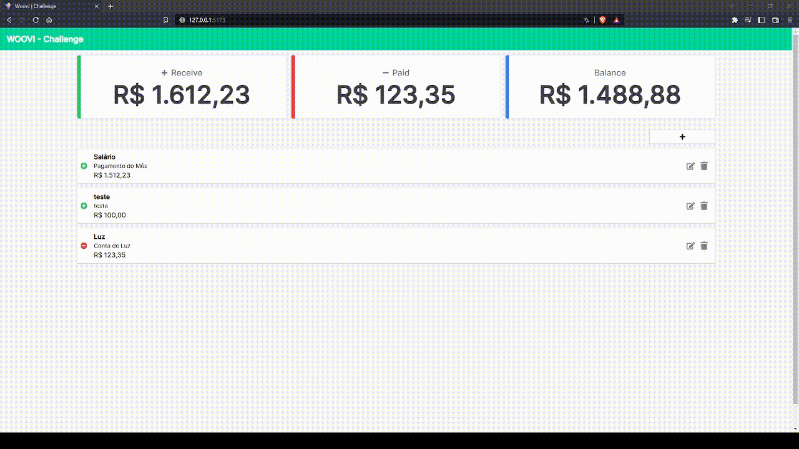

<h1 align="left">
    <a href="https://pt-br.reactjs.org/">🔗 Woovi Challenge</a> 
</h1>


<p align="left" style="margin-top:5px">🚀 Web apllication (finance control) developed using React JS (Vite) + TypeScript + TailwindCSS + Relay + Node JS + Prisma + TypeGraphQL technologies.</p> 


Running
=================

#### 🧭 Running in a browser (Frontend)

```bash

# Clone this repository
$ git clone git@github.com:wallacefreitas/woovi-challenge.git

# Access the folder project in your terminal/cmd
$ cd woovi-challenge/web

# Create a file .env and add a variable:
VITE_API_URL=http://localhost:4000/

# Install the dependencies
$ yarn

# Run  the application in development mode
$ yarn dev

# The application will open in port:5173 - go to http://127.0.0.1:5173/

```

#### 🧭 Running in a server (Backend)

```bash

# Access the folder project in your terminal/cmd
$ cd woovi-challenge/server

# Create a file .env and add a variable:
DATABASE_URL="file:../src/database/db.sqlite"

# Install the dependencies
$ npm i

# Execute Prisma Generate
npx prisma generate

# Run  the application in development mode
$ npm run dev

# The application will open in port:4000 - go to http://localhost:4000/

```
---

## 🛠 Technologies

The following tools were used in building the project:

#### **Website**  ([React JS](https://reactjs.org/)  +  [TypeScript](https://www.typescriptlang.org/))

-   **[TailwindCSS](https://tailwindcss.com/docs/guides/create-react-app)**
-   **[Relay](https://relay.dev/)**

> See the file  [package.json](package.json)

#### **Server**  ([Prisma](https://www.prisma.io/)  +  [TypeGraphQL](https://prisma.typegraphql.com/docs/basics/installation/))

-   **[SQLite](https://www.sqlite.org/index.html)**

> See the file  [package.json](package.json)

---

## 📷 Screenshots




---

## 📝 License

This project is under license [MIT](LICENSE.md).

Made by Wallace de Freitas 👋🏽